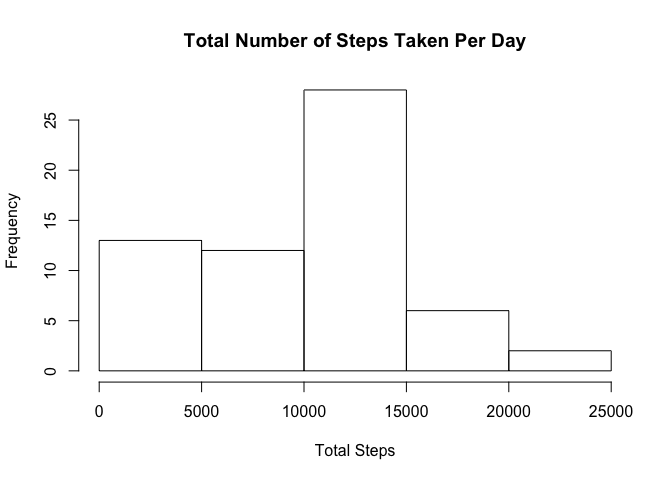
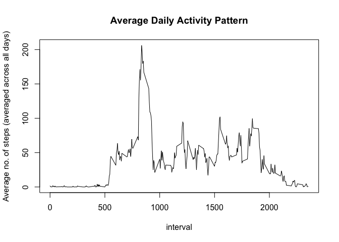
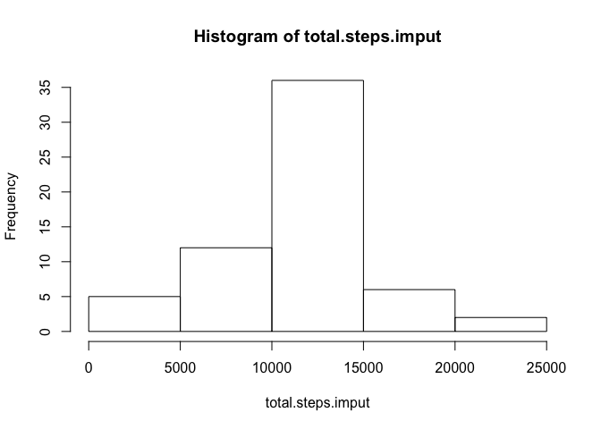
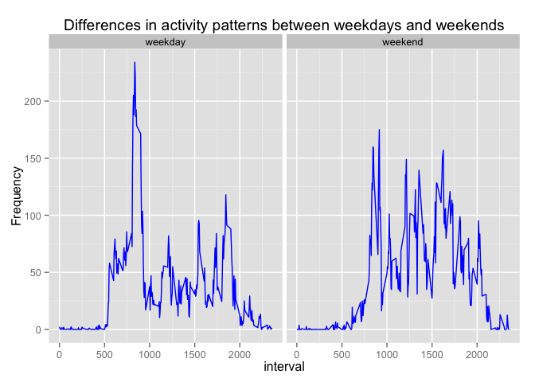

# Reproducible Research: Peer Assessment 1

## Loading and preprocessing the data

This data set is taken from https://d396qusza40orc.cloudfront.net/repdata%2Fdata%2factivity.zip, and is loaded and preprocessed as follows:

```r
if (!file.exists("./data")) { dir.create("./data") }
if (!file.exists("./data/activity.zip")) { download.file("https://d396qusza40orc.cloudfront.net/repdata%2Fdata%2factivity.zip","./data/activity.zip",method="curl") }
if (!file.exists("./data/activity.csv")) { unzip("data/activity.zip", exdir="./data") }
activity <- read.csv("data/activity.csv", header=TRUE, nrows=17700, colClasses = "character")

activity$interval <- as.integer(activity$interval)
activity$steps <- as.integer(activity$steps)
activity$date <- as.Date(activity$date, format="%Y-%m-%d")
```

## What is mean total number of steps taken per day?

First, we calculate the total number of steps taken per day,
as a new dataset.  Next, we plot its histogram and
calculate the mean (and median) of the dataset.


```r
s <- split(activity, activity$date)
total.steps <- sapply(s, function(x) sum(x[, "steps"], na.rm=TRUE))
hist(total.steps, xlab="Total Steps", main="Total Number of Steps Taken Per Day")
```

 

```r
mean.steps <- mean(total.steps)
median.steps <- median(total.steps)
mean.steps
```

```
## [1] 9354.23
```

```r
median.steps
```

```
## [1] 10395
```
Here, we can see that the mean total number of steps taken per day is 9354.23 (and the median total number of steps taken per day is 10395).

## What is the average daily activity pattern?

The average daily activity pattern is obtained by taking
an average for each interval in the data set.


```r
library(ggplot2)
library(dplyr)
```

```
## 
## Attaching package: 'dplyr'
## 
## The following object is masked from 'package:stats':
## 
##     filter
## 
## The following objects are masked from 'package:base':
## 
##     intersect, setdiff, setequal, union
```

```r
s5 <- split(activity, activity$interval)
average.steps <- sapply(s5, function(x) mean(x[, "steps"], na.rm=TRUE))
df.interval <- group_by(tbl_df(activity),interval)
average.steps1 <- summarize(df.interval,mean(steps, na.rm=TRUE))
names(average.steps1)[2] <- "average.steps"
```

The average daily activity pattern is illustrated with
a time series plot of the 5-minute interval (x-axis) and
the average number of steps taken, averaged across all
days (y-axis):

```r
#plot(average.steps, type="l")
plot(average.steps1, type="l", main="Average Daily Activity Pattern", ylab="Average no. of steps (averaged across all days)")
```

 

The five-minute interval that contains the most number steps,
is calculated as follows:

```r
average.steps1[which.max(average.steps1$average.steps),]$interval
```

```
## [1] 835
```

## Imputing missing values

The total number of missing values in the dataset (i.e. total number of rows with NAs) is:

```r
sum(is.na(activity$steps))
```

```
## [1] 2304
```

We wish to create a new dataset with missing steps replaced
by imputed data calculated earlier in the data frame
`average.steps`. Note that the imputed values are rounded
using the `round()` function as the no. of steps needs to
be an integer.


```r
df.imput <- activity
df.imput$s <- df.imput$interval
df.imput$s <- average.steps[as.character(df.imput$s)]
df.imput$steps <- ifelse(is.na(df.imput$steps),round(df.imput$s),df.imput$steps)
df.imput <- df.imput[,!(names(df.imput) %in% c("s"))]
```

The new data set (that is equal to the original dataset
but with the missing data filled in using imputed data)
is named `df.imput`

The total number of steps taken each day is plotted as a histogram:

```r
s.imput <- split(df.imput, df.imput$date)
total.steps.imput <- sapply(s.imput, function(x) sum(x[, "steps"], na.rm=TRUE))
hist(total.steps.imput)
```

 

```r
mean.steps.imput <- mean(total.steps.imput)
median.steps.imput <- median(total.steps.imput)
mean.steps.imput
```

```
## [1] 10765.64
```

```r
median.steps.imput
```

```
## [1] 10762
```

The mean and median total number of steps taken per day are
1.076564\times 10^{4} and
1.0762\times 10^{4} respectively.

These values **are different** from the estimates which
were performed earlier. The impact of imputing missing data
is a shift in the histogram: the frequency corresponding
to the 0-5000 range is reduced and the histogram appears
more symmetric.

## Are there differences in activity patterns between weekdays and weekends?

First, a factor variable is created, which indicates whether
the date falls on a weekday or a weekend

```r
activity$wknd <- weekdays(activity$date)
activity$wknd <- ifelse(activity$wknd=="Saturday" | activity$wknd=="Sunday", "weekend", "weekday")
activity$wknd <- factor(activity$wknd)
```

Finally, a panel plot showing the differences between weekdays
and weekends is created:

```r
library(dplyr)
df1 <- tbl_df(activity)
df1 <- group_by(df1,interval,wknd)
df2 <- summarize(df1,mean(steps, na.rm=TRUE))
names(df2)[3] <- "steps"
g <- ggplot(df2, aes(interval, steps))
g + geom_line(color="blue") + facet_grid(. ~ wknd) + labs(title="Differences in activity patterns between weekdays and weekends") + labs(y = "Frequency")
```

 

Note that figure files in this document are placed in the following folder of this repository: `PA1_template_files/figure-html/`
